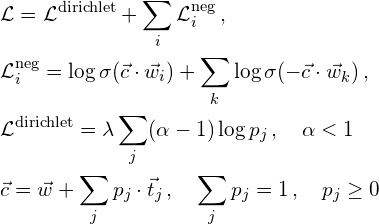

# lda2vec
`pytorch` implementation of Moody's lda2vec, a way of topic modeling using word embeddings. The original paper:
[Mixing Dirichlet Topic Models and Word Embeddings to Make lda2vec](https://arxiv.org/abs/1605.02019).

**Warning:**
I, personally, believe that lda2vec algorithm isn't working.  
Sometimes it finds a couple of topics, sometimes not. Usually a lot of found topics are a total mess.  
The algorithm is prone to poor local minima. It greatly dependents on values of initial topic assignments.

## Loss
The training proceeds as follows. First, convert a document corpus to a set of tuples  
`{(document id, word, the window around the word) | for each word in the corpus}`.  
Second, for each tuple maximize the following objective function

where `c` - context vector, `w` - embedding vector for a word, `lambda` - positive constant that controls sparsity, `i` - sum over the window around the word, `k` - sum over sampled negative words, `j` - sum over topics, `p` - probability distribution over topics for a document, `t` - topic vectors.  
When training I also shuffle and batch the tuples.

## Implementation details
* I use vanilla LDA to initialize lda2vec (topic assignments for each document). It is not like in the original paper. It is not how it supposed to work.  
Also I use temperature to smoothen the initialization in the hope that lda2vec will have a chance to find better topic assignments.
* I add noise to some gradients while training.
* I reweight loss according to document lengths.
* Before training lda2vec I train 50-dimensional skip-gram word2vec to initialize the word embeddings.
* For text preprocessing:
  1. do word lemmatization
  2. remove rare and frequent words

## Requirements
* pytorch 0.2, spacy 1.9, gensim 3.0
* numpy, sklearn, tqdm
* matplotlib, [Multicore-TSNE](https://github.com/DmitryUlyanov/Multicore-TSNE)
